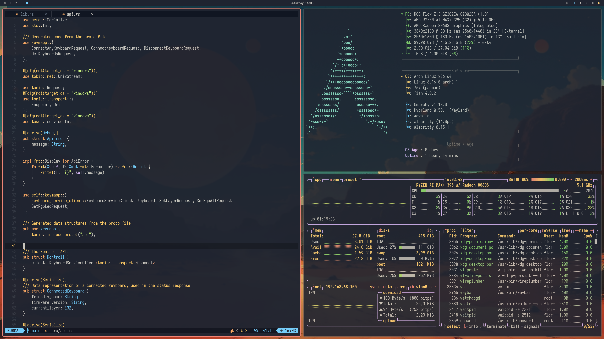
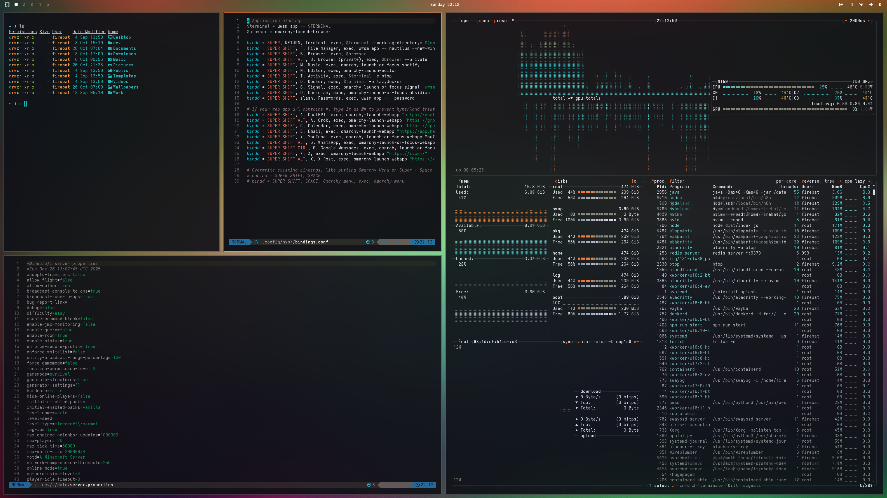

# Hyprpunk

<div align="center">

**A complete Hyprland desktop environment profile for Fedpunk**

*Keyboard-driven workspace with live theming, vim-style navigation, and modern development tools*

[](LICENSE)
[](https://getfedora.org/)

---

## See It In Action

[](https://vimeo.com/1140211449)

*Click to watch: Live theme switching, keyboard-driven workflow, and seamless module deployment*

### [**Watch Full Demo on Vimeo**](https://vimeo.com/1140211449)

</div>

---

## Quick Start

```bash
# Install Fedpunk
sudo dnf copr enable hinriksnaer/fedpunk
sudo dnf install fedpunk

# Deploy hyprpunk
fedpunk profile deploy https://github.com/hinriksnaer/hyprpunk.git --mode desktop
```

**Other modes:**
```bash
# Laptop (no NVIDIA, battery optimized)
fedpunk profile deploy https://github.com/hinriksnaer/hyprpunk.git --mode laptop

# Container (terminal only, no GUI)
fedpunk profile deploy https://github.com/hinriksnaer/hyprpunk.git --mode container
```

---

## What's Included

### Desktop Environment
- **Hyprland** - Wayland compositor with vim-style navigation
- **Kitty** - GPU-accelerated terminal
- **Rofi** - Application launcher
- **Hyprlock** - Screen locker
- **Mako** - Notification daemon

### Development Tools
- **Neovim** - Text editor with full LSP support
- **Tmux** - Terminal multiplexer
- **Lazygit** - Git TUI
- **Yazi** - File manager TUI
- **GitHub CLI** - GitHub integration

### Applications
- **Zen Browser** - Privacy-focused browser
- **Bitwarden CLI** - Password manager
- **Spotify** - Music (Flatpak)
- **Discord** - Communication (Flatpak)
- **Slack** - Team collaboration (Flatpak)

---

## Themes

**12 themes with instant live-reload across all applications:**

| Theme | Style |
|-------|-------|
| **aetheria** | Ethereal purple/blue gradients |
| **ayu-mirage** | Warm desert tones |
| **catppuccin** | Soothing pastel (mocha) |
| **catppuccin-latte** | Light mode elegance |
| **matte-black** | Pure minimalism |
| **nord** | Arctic cool tones |
| **osaka-jade** | Vibrant teal/green |
| **ristretto** | Rich espresso browns |
| **rose-pine** | Soft rose/pine palette |
| **rose-pine-dark** | Deep rose/pine |
| **tokyo-night** | Deep blues with neon |
| **torrentz-hydra** | Bold high contrast |

### Theme Commands

```bash
hyprpunk-theme-list          # List themes
hyprpunk-theme-set tokyo-night   # Switch theme
hyprpunk-theme-next          # Next theme
hyprpunk-wallpaper-next      # Next wallpaper
```

**Shortcuts:**
- `Super+T` - Theme selector
- `Super+Shift+T` - Next theme
- `Super+Shift+W` - Next wallpaper

### Theme Previews

**Ayu Mirage**


**Tokyo Night**


**Torrentz Hydra**


---

## Modes

| Mode | Use Case | Includes |
|------|----------|----------|
| **desktop** | Full workstation | GUI, NVIDIA, audio, bluetooth |
| **laptop** | Mobile use | GUI, no NVIDIA, battery optimized |
| **container** | Development | Terminal tools only |

---

## Keyboard Shortcuts

### Windows
- `Super+Return` - Terminal
- `Super+Q` - Close window
- `Super+H/J/K/L` - Focus (vim-style)
- `Super+1-9` - Switch workspace
- `Super+Shift+1-9` - Move to workspace
- `Super+F` - Fullscreen
- `Super+V` - Float

### Apps
- `Super+Space` - Launcher
- `Super+B` - Browser
- `Super+E` - File manager

### Screenshots
- `Print` - Selection
- `Super+Print` - Full screen

---

## Structure

```
hyprpunk/
├── modes/           # desktop, laptop, container
├── themes/          # 12 complete themes
└── modules/         # Desktop-focused modules
```

---

## Requirements

- Fedora 40+
- x86_64
- 8GB RAM (16GB recommended)
- Wayland-capable GPU

---

## License

MIT License - See [LICENSE](LICENSE)

---

Built on [Fedpunk](https://github.com/hinriksnaer/Fedpunk) • Powered by [Hyprland](https://hyprland.org)
